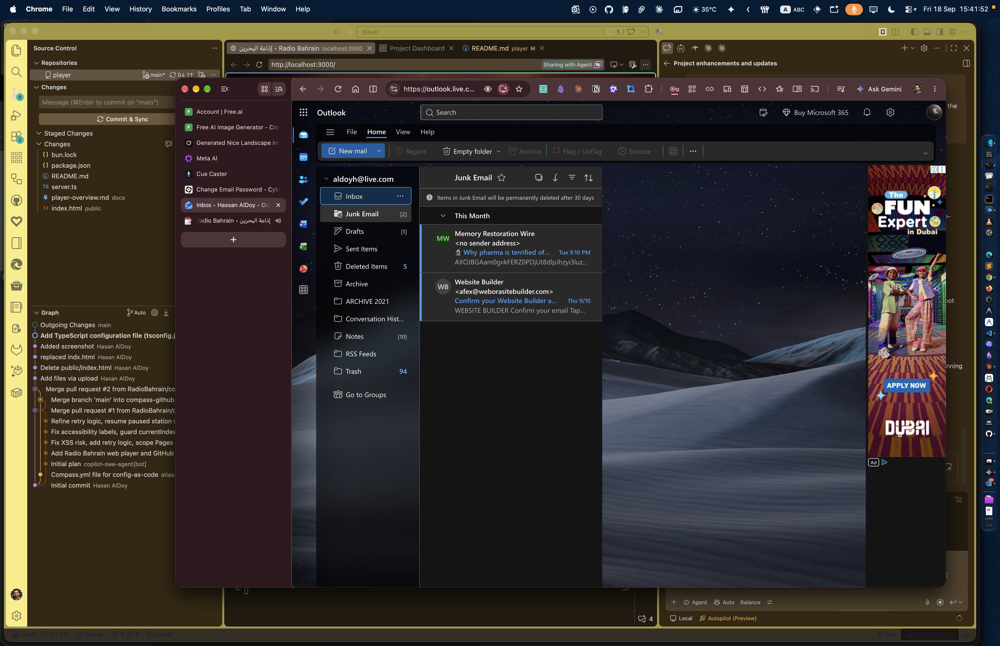

# Radio Bahrain Player

A local, Bun-powered radio player for Bahrain live channels with a cinematic splash screen, animated audio visualizer, and channel-specific art transitions.

## Features

- Bun-managed dependencies for a self-contained runtime
- No remote CDN runtime scripts required
- Preloading splash followed by an explicit start button to unlock audio correctly
- Channel switcher using the available local background art in `public/assets/`
- Smooth artistic transmission background changes when the active channel changes
- Animated waveform and pulse visualizer for live radio playback

## Run locally

```bash
bun install
bun run dev
```

Open:

http://localhost:3000

## Production run

```bash
bun run start
```

## Local dependency setup

The project installs the required libraries with Bun so it does not need to fetch runtime dependencies from external CDNs:

- `gsap`
- `hls.js`

## Project structure

- `public/index.html` – the player UI and logic
- `public/assets/` – channel background images
- `server.ts` – local Bun static server
- `docs/player-overview.md` – project documentation

## Screenshot


